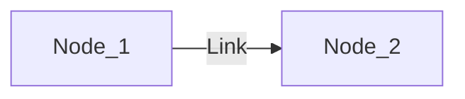
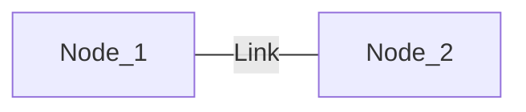
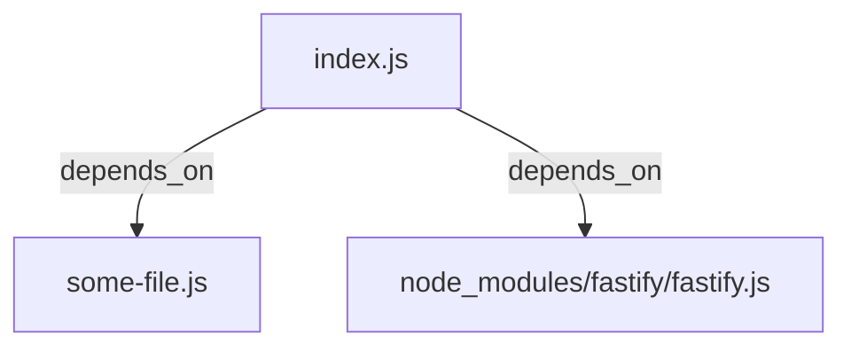
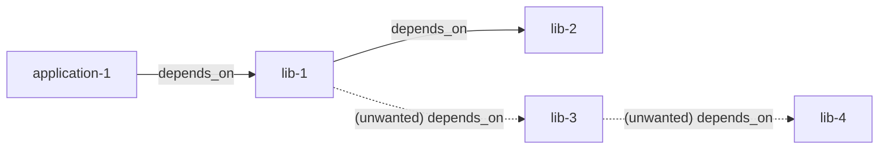

---
# try also 'default' to start simple
theme: default
# random image from a curated Unsplash collection by Anthony
# like them? see https://unsplash.com/collections/94734566/slidev
background: https://images.unsplash.com/photo-1639322537231-2f206e06af84?q=80&w=1932&auto=format&fit=crop&ixlib=rb-4.0.3&ixid=M3wxMjA3fDB8MHxwaG90by1wYWdlfHx8fGVufDB8fHx8fA%3D%3D&utm_source=unsplash_source&w=1920
# apply any windi css classes to the current slide
class: 'text-center'
# https://sli.dev/custom/highlighters.html
highlighter: shiki
# show line numbers in code blocks
lineNumbers: false
# some information about the slides, markdown enabled
info: |
  ## Antoine Coulon, Accelerator
  
  Unleash the power of Node.js graphs with skott
# persist drawings in exports and build
drawings:
  persist: false
# use UnoCSS (experimental)
css: unocss
---

# Unleash the power of Node.js graphs with skott

### Antoine Coulon @ Accelerator #1 - 12/06/2023

---
layout: center
---

# Antoine Coulon

<div class="grid grid-cols-[3fr,2fr]">
  <div class="text-center pb-4">
    <div class="leading-8 opacity-80">
      Software Engineer @ evryg
      <br>
      Open Source Maintainer 
    </div>
  </div>
  <div class="border-l border-gray-400 border-opacity-25 !all:leading-12 !all:list-none my-auto">
  </div>

  <div class="text-center">
    <div class="p-2">
    GitHub: antoine-coulon <br>
    </div>
    Twitter: c9antoine
  </div>
</div>

<style>
h1 {
  color: #008ad6;
}
</style>


---

# Graphs in a nutshell

<div>

- Abstract representation of objects and the relationships that they have between them
- a "node" represents an object of the graph
- a "link" represent the relationship between two "nodes"

<div class="text-center grid grid-cols-2 gap-x-4 pt-5"><div>

## Directed graph

<div class="pt-5">

</div>

</div>
<div>

## Undirected graph


<div class="pt-5">

</div>
</div>
</div></div>


<!-- 

Abstract representation of objects and the relationships that they have between them.

- node
- links

We have two types of graphs, directed and undirected

Directed, links have a direction and express 
We say Node_1 "depends on" Node_2

Undirected, links have a relation that expresses directions
Undirected express a respective path between two nodes, think about a roadmap where you can go from a city to another city

 -->

---

# Graphs are everywhere, at all levels

<div v-click>
- <b>Databases</b>: Neo4J, Apache TinkerPop, Amazon Neptune...
</div>


<div v-click class="pt-2">
- <b>Distributed orchestration/processing systems</b>: Kubernetes, Apache Spark, Apache Airflow, CI/CD pipelines
</div>

<div v-click class="pt-2">
- <b>Local systems</b>: git, monorepos (Rush, Nx, Bazel), Makefile
</div>

<div v-click class="pt-2">
- <b>Compilers/Interpreters/Runtimes</b>: library linking, module resolution (dependency graphs), task orchestration/scheduling
</div>

<div v-click class="pt-2">
- <b>OS level</b>: resource management, process trees, task orchestration/scheduling
</div>

<!-- 

DBs:
- Storing and querying highly interconnected data, such as social networks, recommendation systems, and complex relationships.

Distributed: 
- Representing and managing the flow of tasks, dependencies between tasks, and the orchestration of distributed processes.

Local:
- On a local machine, Git manages a dependency graph to represent the history, branching, forking, parent-child relationships, all that

Compilers:
- Modeling and resolving dependencies between code modules during linking, representing control flow graphs for program execution, and managing dependencies between libraries and modules.

OS level: 
- representing dependencies between different components in the operating system and managing resources
- orchestrating tasks in parallel or sequentially

-->
--- 

# What about Node.js 

Both Node.js and the ecosystem heavily rely on graphs

- Runtime internals: program parsing (ASTs) and evaluation, garbage collection, etc
- Dependencies management: package managers maintain a dependency graph
- Module systems: resolving the full dependency graph through module resolution

<div class="grid grid-cols-2 gap-x-4 pt-5">

<div v-click>
<b> index.js </b>

```js
// Third-party 
import Fastify from "fastify";

// Local module
import { something } from "./some-file.js";
```
</div>

<div v-click class="text-center pt-5">



</div>
</div>

--- 

# Node.js ecosystem

Who else relies on graphs?

- Compilers/transpilers: TypeScript, Babel
- Bundlers: webpack, rollup, esbuild
- Package managers: npm, yarn, pnpm


---

# Mastering its own graph is important

Graph is the skeleton of the project

- Revealing implicit/hidden dependencies, hard to track by just reading code 
- Revealing circular dependencies that can be harmful at run-time or that could highlight design smells
- Having a clear vision of project design, that can be highlighted using visual patterns (hierarchical/clustering)
- Highlighting dead code, unused dependencies, everything that could be/not be potentially pruned/tree-shaken

---

# A small example of harmful hidden dependencies

In the context of a monorepo, "lib-1" depends on "lib-3" by mistake hence pulling a whole sub-graph for nothing

<div class="text-center">



</div>

Consequences:

- increased compute time
- side effects on bundling / producing artifacts 
- probably more depending on the context

<!-- 
Here is an example in the context of monorepos, even though this could be applied to CI/CD pipelines or whatever system depending on graphs.

Note that you could say "well manage correctly your dependencies"
but that's hard because:

- dependencies could be created through config files, manifest files (package.json) or source code (static analysis)
- hard to track at a certain scale given a certain pace of change
- depends on the way of how dependencies are created

-->

---

# Graphs are powerful yet opaque

Most of the time it is difficult to do so

- Internally abstracted: Often embedded and abstracted within the core, limiting accessibility
- API limitations: lack of consumable APIs and primitives to traverse, introspect, get sub-graphs
- Visualization Gap: Absence of built-in visualization capabilities poses a hurdle for seamless user/developer experiences.

How to unleash the full power of graphs?

<!-- 
GitHub actions and Azure DevOps understood that and draw graphs for pipelines
-->

---

# Introducing <b color="blue">skott</b>

### All-in-one devtool to automatically analyze, search and visualize dependencies

<div class="pt-5">
<li>Works with JavaScript (+JSX), TypeScript (+TSX), ESM, CJS</li>
<li>Raw graph structure exposed + workspace information + various metadata </li>
<li>Graph API including traversal primitives (DFS/BFS/backtracking), deep circular dependencies detection</li>
<li>Dependency tracking (local, third-party, builtin, unused)</li>
<li>Builtin visualization: web application, CLI, static files e.g. mermaid </li>
<li>Works config-less</li>
</div>

---

# How to use <b color="blue">skott</b>

<div class="grid grid-cols-2 gap-x-4 pt-5">

<div v-click>

**CLI**

```bash
skott 
      --displayMode="webapp"
      --fileExtensions=".ts" 
      --ignorePattern="__tests__/**/*"
```


</div>

<div v-click>

**Node.js API**

```js
import skott from "skott";

const { 
  getStructure, 
  getWorkspace, 
  findUnusedDependencies, 
  useGraph 
  } = await skott({
    // Whatever API option there
});

// Do whatever you want with the generated graph
const { graph, files } = getStructure();
const workspace = getWorkspace();
const unusedDependencies = await findUnusedDependencies();
const { 
  findCircularDependencies, 
  collectFilesDependencies, 
  ...traversalApi } = useGraph();

```

</div>
</div>

---

# Nevermind let's do a quick demo

---

# More to come 

<b color="cyan">https://github.com/antoine-coulon/skott</b>

- Improve overall visualization and especially circular dependencies + their detection
- Support "imports" map and "exports" map (self-referencing aliasing)
- skott plugin for Rush.js monorepo tool
- Adapters for npm/pnpm/yarn workspaces
- Better caching support
- Watch mode to refresh web application on code changes

---

# Questions ?

<div class="grid grid-cols-2 gap-x-4 pt-5">

<div>

</div>

<div>

Thanks for listening! 

Repo link: <b color="cyan">https://github.com/antoine-coulon/skott</b>

digraph-js library:  <b color="cyan">https://github.com/antoine-coulon/digraph-js</b>

Small dev.to series around JS graphs: <b color="cyan"> https://dev.to/antoinecoulon/master-directed-graphs-by-example-with-javascript-4oef
</b>
</div>

</div>
---